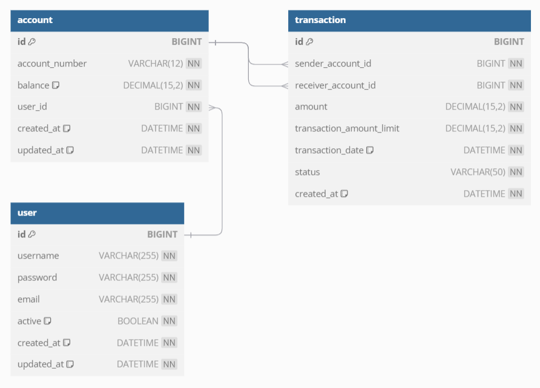

# 🏦 AutumnFintech - 금융 서비스 플랫폼

AutumnFintech는 손쉽게 계좌를 관리하고 송금을 할 수 있는 금융 서비스 백엔드 API입니다. 

---

## 📌 주요 기능

### 1. 계좌 관리
- **계좌 생성**: 인증된 사용자가 새로운 계좌를 생성합니다.
- **계좌 상세 조회**: 사용자 계좌의 ID를 통해 계좌 세부 정보를 가져옵니다.
- **계좌 소유자 이름 조회**: 계좌 번호를 통해 계좌 소유자의 이름을 확인합니다.
- **사용자 계좌 목록 조회**: 인증된 사용자의 모든 계좌를 조회합니다.
- **계좌 삭제**: 잔액이 0일 경우 계좌를 삭제합니다.
- **송금/출금 한도 설정**: 사용자는 자신의 계좌에 대한 송금/출금 한도를 설정할 수 있습니다.

### 2. 거래 관리
- **입금 처리**: 특정 계좌에 금액을 입금합니다.
- **출금 처리**: 사용자의 계좌에서 금액을 출금합니다.
- **송금 처리**: 계좌 간 송금을 처리합니다.
- **송금 내역 조회**: 사용자의 거래 내역을 페이징 처리하여 조회합니다.
- **송금 취소**: 거래 후 1시간 이내에 송금을 취소할 수 있습니다.

### 3. 관리자 기능
- **송금 수수료 설정**: 모든 송금에 대한 수수료를 설정합니다 (관리자 전용).
- **계좌 활성화/비활성화**: 계좌의 활성화 상태를 설정합니다 (관리자 전용).
- **계좌 송금 한도 설정**: 특정 계좌에 대한 송금 한도를 설정합니다 (관리자 전용).

---

## 🛠️ 기술 스택 (Tech Stack)

- **Back-end**: Java, Spring Boot, Spring Security, JPA
- **Database**: MySQL
- **Authentication**: JWT (JSON Web Token)
- **Build Tool**: Gradle
- **API Documentation**: Swagger 

---

## 🗂️ 프로젝트 구조 (Project Structure)

```
AutmnFintech
│
├── src
│   ├── main
│   │   ├── java/com/fintech
│   │   │   ├── config
│   │   │   ├── controller
│   │   │   ├── dto
│   │   │   ├── entity
│   │   │   ├── exception
│   │   │   ├── jwt
│   │   │   ├── repository
│   │   │   └── service
│   └── test
├── build.gradle
└── README.md
```

---

## 🗒️ ERD (Entity Relationship Diagram)
**ERD**를 통해 프로젝트의 엔티티 구조를 한눈에 볼 수 있습니다.  
[자세한 ERD 보기](https://dbdiagram.io/d/66f4cc273430cb846ca6d336)



---

## 🚀 API 명세서
API 명세서는 **Swagger**를 통해 자동 생성됩니다. Swagger UI에서 API 엔드포인트 정보를 확인하고, 직접 테스트할 수 있습니다.  
서버 실행 후 아래 URL을 통해 접근할 수 있습니다:
- [http://localhost:8080/swagger-ui.html](http://localhost:8080/swagger-ui.html)

---

## 🔧 환경 설정 (Custom Configuration)

프로젝트를 실행하기 전, `src/main/resources/application.properties` 파일의 일부 설정을 환경에 맞게 수정해야 합니다. 아래는 설정 항목에 대한 설명입니다.

### 1. **애플리케이션 이름**
```properties
spring.application.name=AutumnFintech
```
- **설명**: Spring Boot 애플리케이션의 이름을 정의합니다. 필요에 따라 프로젝트에 맞는 이름으로 변경할 수 있습니다.

### 2. **데이터베이스 설정**
```properties
spring.datasource.url=jdbc:mysql://localhost:3306/fintech?useSSL=false&useUnicode=true&allowPublicKeyRetrieval=true
spring.datasource.driver-class-name=com.mysql.cj.jdbc.Driver
spring.datasource.username=root
spring.datasource.password=root
```
- **`spring.datasource.url`**: MySQL 데이터베이스 URL입니다. `localhost:3306` 부분을 실제 데이터베이스 호스트와 포트로 수정해야 합니다. 또한, `fintech`는 데이터베이스 이름이므로, 사용할 데이터베이스 이름으로 변경하세요.
    - 예시: `jdbc:mysql://your-database-host:3306/your-database-name`

- **`spring.datasource.username`**: 데이터베이스 사용자 이름을 입력합니다. 기본값은 `root`로 설정되어 있지만, 실제 데이터베이스 사용자로 변경해야 합니다.

- **`spring.datasource.password`**: 데이터베이스 비밀번호를 입력합니다. `root` 대신 해당 사용자에 맞는 비밀번호로 수정합니다.

### 3. **JPA 및 Hibernate 설정**
```properties
spring.jpa.show-sql=true
spring.jpa.hibernate.ddl-auto=update
spring.jpa.properties.hibernate.dialect=org.hibernate.dialect.MySQLDialect
```
- **`spring.jpa.show-sql`**: SQL 쿼리를 로그로 출력할지 여부를 결정합니다. 개발 중에 쿼리를 확인하려면 `true`로 설정하고, 배포 환경에서는 `false`로 설정하는 것이 좋습니다.

- **`spring.jpa.hibernate.ddl-auto`**: Hibernate가 데이터베이스 스키마를 어떻게 관리할지 설정합니다. `update`는 애플리케이션 실행 시 스키마를 자동으로 업데이트합니다. 배포 환경에서는 신중하게 관리하기 위해 `none`이나 `validate`로 설정하는 것이 좋습니다.

- **`spring.jpa.properties.hibernate.dialect`**: Hibernate가 사용할 SQL 방언을 지정합니다. 사용 중인 데이터베이스에 맞는 방언을 설정해야 합니다. MySQL을 사용하는 경우 `org.hibernate.dialect.MySQLDialect`가 적합합니다.

### 4. **로깅 설정**
```properties
logging.level.org.springdoc=DEBUG
```
- **설명**: `springdoc` 라이브러리의 로깅 수준을 설정합니다. 기본적으로 `DEBUG`로 설정되어 있으며, 배포 환경에서는 `INFO` 또는 `WARN`으로 변경하는 것이 좋습니다.

### 5. **JWT 설정**
```properties
spring.jwt.secret=YourSecretKeyMustBeAtLeast32CharactersLong
```
- **설명**: JWT 토큰을 생성하고 검증할 때 사용할 비밀 키입니다. 반드시 32자 이상이어야 하며, 강력한 비밀 키로 변경해야 합니다.

---

### ⚠️ 주의사항:
- **데이터베이스 보안**: `spring.datasource.username`과 `spring.datasource.password` 설정에 실제로 사용하는 데이터베이스 사용자 정보와 비밀번호를 적절히 보호하세요. 가능하면 환경 변수나 외부 설정 파일로 분리하는 것을 권장합니다.

- **JWT 비밀 키**: `spring.jwt.secret`은 절대로 공개 레포지토리에 노출되지 않도록 주의하세요. 민감한 정보는 `.env` 파일이나 Kubernetes 시크릿 등 안전한 방법으로 관리하는 것이 좋습니다.

---
