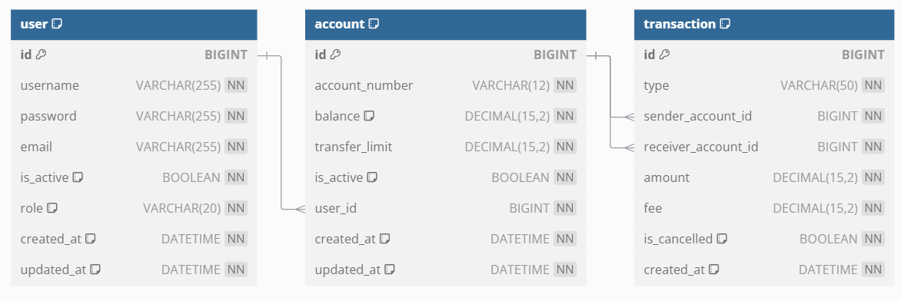

# 🏦 AutumnFintech - 금융 서비스 플랫폼

AutumnFintech는 사용자들이 손쉽게 계좌를 관리하고 송금을 할 수 있는 금융 서비스 백엔드 API입니다.

---

## 📋 요구사항 (Requirements)

### 1. 사용자 관리

- **회원가입**: 사용자는 이메일, 비밀번호, 사용자명을 입력하여 회원가입할 수 있습니다.
- **로그인**: Spring Security와 JWT를 이용하여 로그인 및 인증을 처리합니다.
- **회원 탈퇴**: 보유 중인 계좌에 잔액이 없는 경우 탈퇴할 수 있습니다.

### 2. 보안 및 인증

- **로그인 시 계좌 접근 권한 부여**: 로그인한 사용자는 발급받은 토큰을 통해 자신의 계좌에만 접근할 수 있습니다.
- **비밀번호 암호화**: 회원가입 시 비밀번호는 암호화되어 저장됩니다.

### 3. 계좌 관리

- **계좌 생성**: 사용자는 하나 이상의 계좌를 생성할 수 있으며, 계좌번호는 자동으로 생성되고 잔액은 0원으로 초기화됩니다.
- **계좌 삭제**: 계좌에 잔액이 없는 경우에만 삭제가 가능합니다.
- **계좌 검색**: 계좌번호를 통해 특정 계좌의 정보(계좌 유무, 계좌주 이름)를 조회할 수 있습니다.
- **잔액 조회**: 사용자는 자신의 계좌 잔액을 조회할 수 있습니다.
- **금액 입금**: 사용자는 특정 계좌에 금액을 입금할 수 있습니다.
- **금액 출금**: 잔액보다 많은 금액은 출금할 수 없습니다.
- **거래액 제한**: 사용자나 관리자가 계좌의 송금 또는 인출 금액을 제한할 수 있습니다.

### 4. 송금 관리

- **송금 기능**: 사용자는 자신의 계좌에서 다른 사용자의 계좌로 송금할 수 있습니다.
- **송금 이력 조회**: 자신의 송금 이력을 확인할 수 있습니다.
- **송금 취소**: 1시간 이내에 진행된 송금 거래는 취소할 수 있습니다.

### 5. 관리 기능 (관리자)

- **사용자 관리**: 관리자는 모든 사용자의 정보를 조회, 수정, 삭제할 수 있습니다.
- **계좌 관리**: 관리자는 모든 계좌의 잔액과 상태를 조회하거나 계좌 상태를 동결할 수 있습니다.
- **수수료 설정**: 모든 송금의 수수료를 조정할 수 있습니다.

---

## 🛠️ 기술 스택 (Tech Stack)

- **Back-end**: Java, Spring Boot, Spring Security, JPA
- **Database**: MySQL
- **Authentication**: JWT (JSON Web Token)
- **Build Tool**: Gradle
- **Version Control**: Git
- **API Documentation**: Swagger

---

## 🗂️ 프로젝트 구조 (Project Structure)

```
AutumnFintech
│
├── src
│   ├── main
│   │   ├── java/com/fintech
│   │   │   ├── config 
│   │   │   ├── controller 
│   │   │   ├── dto 
│   │   │   ├── entity 
│   │   │   ├── repository 
│   │   │   └── service 
│   │   └── resources
│   │       └── application.properties
│   └── test
├── build.gradle
└── README.md
```

---

## 🗒️ ERD (Entity Relationship Diagram)



---

## 📆 프로젝트 진행 계획

- **1주차**: 요구사항 분석 및 환경 설정
- **2주차**: 사용자 관리, 보안 및 인증 기능 개발
- **3주차**: 계좌 관리 및 송금 기능 개발
- **4주차**: 관리자 기능 개발
- **5주차**: 테스트 및 배포

---

## 📌 기타 사항

- 추후 기능이 확장됨에 따라 문서 및 기능이 지속적으로 업데이트될 예정입니다.
- 자세한 API 명세는 추후 Swagger를 통해 제공될 예정입니다.


